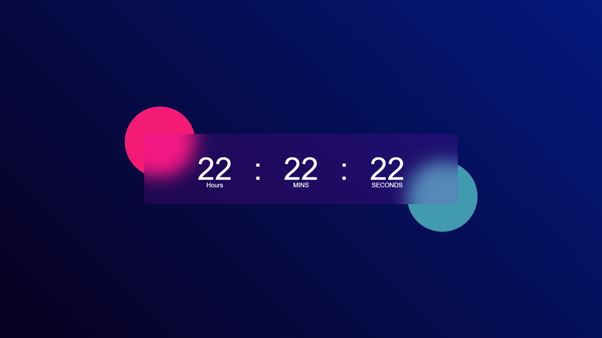
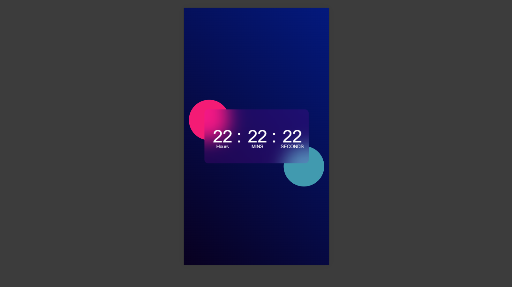

# 🕒 JavaScript Clock

A simple and responsive digital clock built using **HTML**, **CSS**, and **JavaScript**.

## 🧠 Features
- Real‑time digital clock display  
- Responsive design for desktop and mobile  
- Clean and minimal UI  

## 🛠️ Technologies Used
- HTML  
- CSS  
- JavaScript  

## 📸 Preview
### Desktop View

### Mobile View

## 🚀 Live Demo
[View Clock Here](https://hamzanaseem063.github.io/javascript-clock/)
